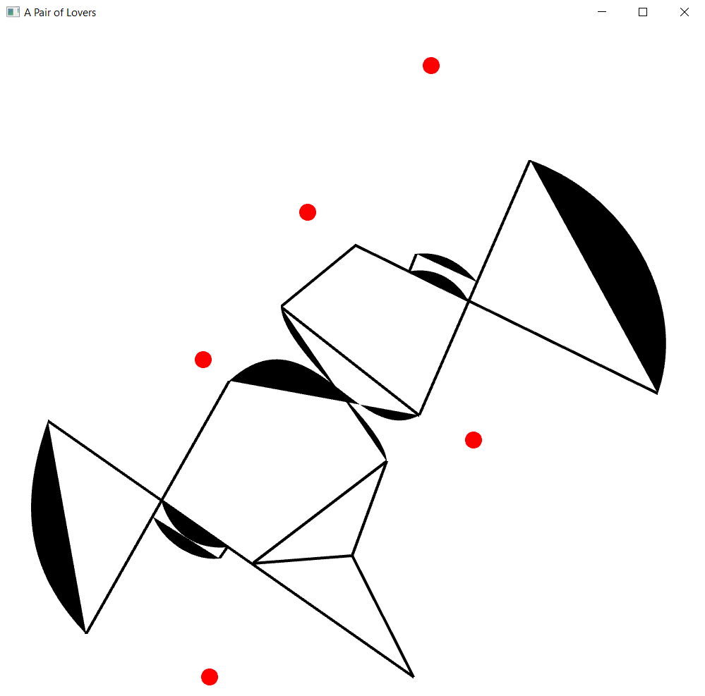
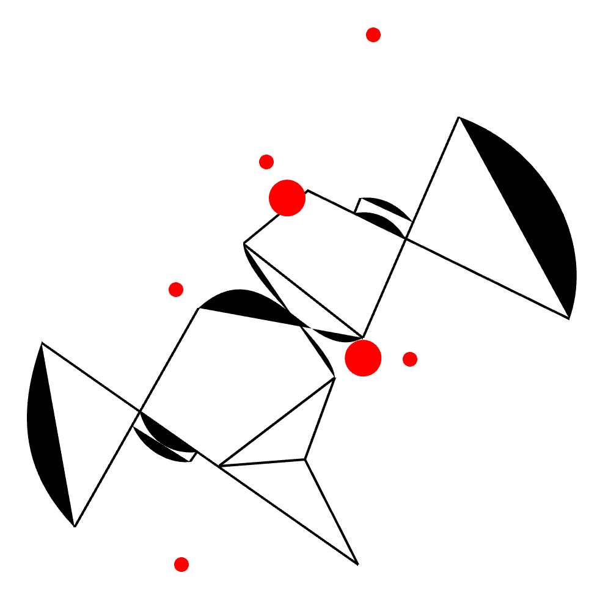

## Week 3:

### Assignment 1 - Still | April 11th: _"Create a series of still images"_

_A Pair of Lovers_ is an artwork made on OpenFrameworks displaying a portrait of a queer couple. The purpose of this piece is to represent the convention of queer representation in formal environments, which is to express this identity in a coded way that fits with the norms of heteronormativity. Its concept is inspired by Picasso’s depiction of a bull. 

 

## The Sketch |

Following his creative process, the project starts as a photograph without any form of abstraction. The next stage shows a sketch where the essential elements of the image are outlined, mainly facial expressions and their position on the canvas. 

 

The following step starts deconstructing the photograph to make it look abstract. Here, the sketching focuses on what would be the previous part before adding details to a portrait, which is using proportion rules to draw both faces.

 

Then, the sketch is replicated using only geometrical shapes and lines. 

 

The sketch is finally finished by keeping only a few shapes and lines that allow the audience’s imagination read the artwork. The mouth and skull are identified with lines and arcs, while the circles give information about their eyes and the limits of their bodies. This was also an artistic choice to give a good composition to the piece.

 

This artistic process mimics the coded language of queer identity that presents sexuality in a euphemistic manner, such as introducing the same-sex partner as a friend or identifying oneself as single to avoid discrimination.

## OpenFrameworks |

The project moves to OpenFrameworks, where the sketch is as an image to get the coordinates of each shape. This step gets a slightly different result since Bézier curves were used instead of arcs to give more homogeneity to the piece. 

 

Moreover, the usage of this software becomes meaningful when the first animation is created. Based on [Dan Buzzo's](https://www.youtube.com/watch?v=uVMyp3HzV_E) tutorial, the program draws two balls that follow the coordinates of the shapes. This symbolizes the pair of lovers that give the name to this piece. 

   

Using OpenFrameworks to add interactivity was discarded since it didn’t add anything to the concept of the project. However, the user can press the spacebar to take screenshots of the animation, but this doesn’t have any symbology behind it.  
 
The simplicity of the colors is meant to guide the audience while looking at the piece. The absence of color in the background leads the spectator to focus on the black shapes, while the red circles give a good aesthetic effect and indicate relevance. This color choice is very simplistic, but it seeks to represent the first stages in the sketching process of a portrait.

As the author of this artwork, I’m almost satisfied with “A Pair of Lovers”. I consider that the concept and its implementation are very solid. However, I think I still need to learn more about what OpenFrameworks has to offer to exploit this medium in the best way possible. It’s a concept that I want to elaborate on in the future to give the audience an immersive experience with meaningful interactivity.

  
  
