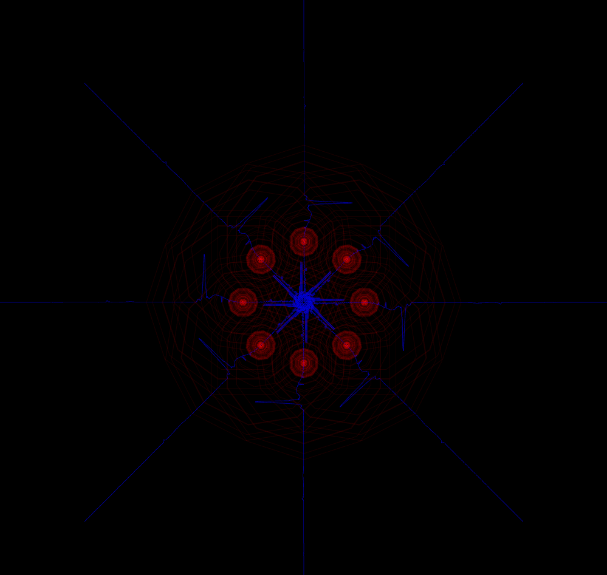
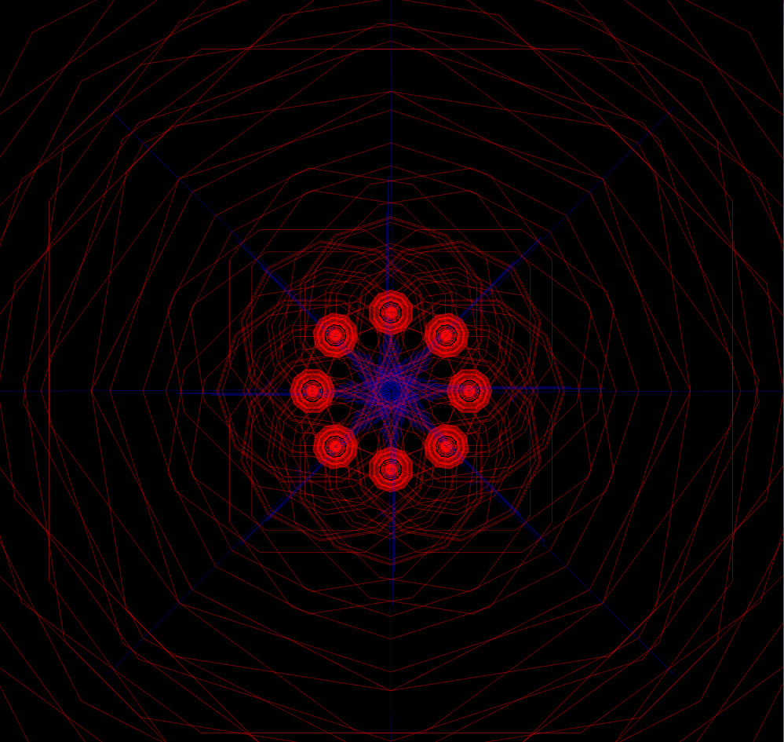
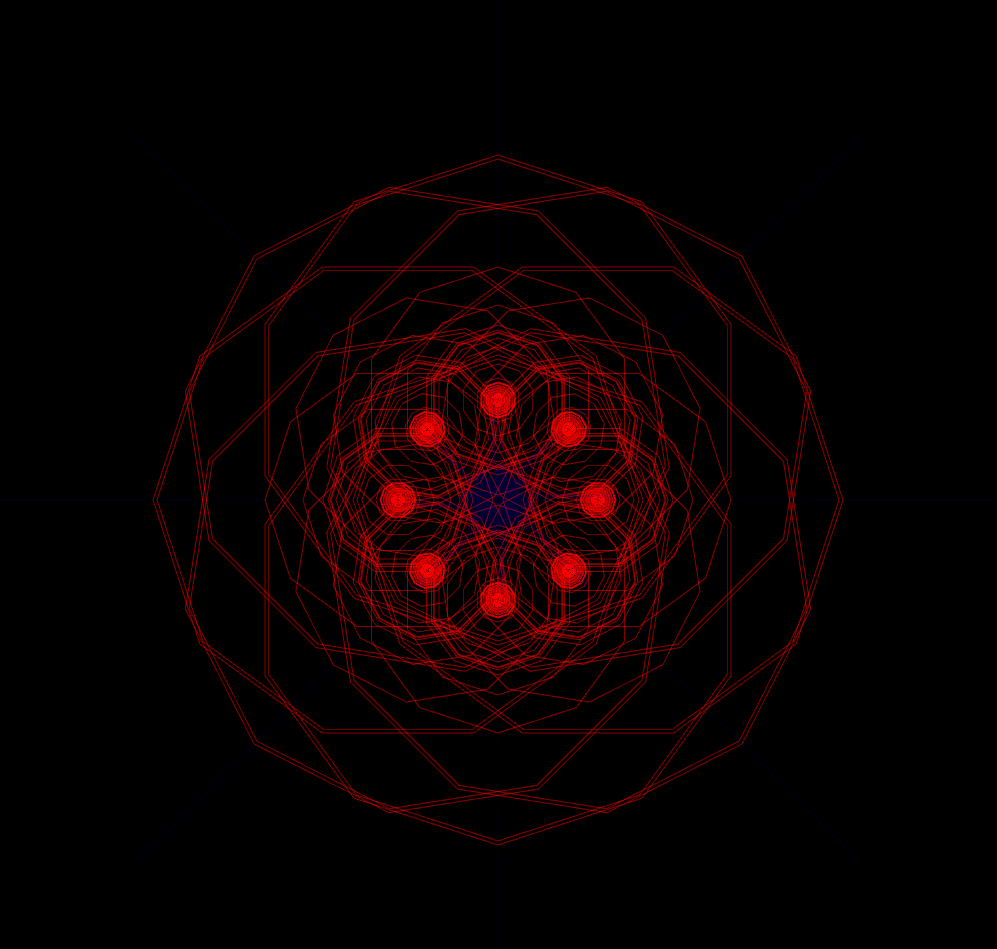

## Week 5:

### Assignment 2 - Motion | April 25th: _"Create an animation"_

_A Pair of Lovers_ is an artwork made on OpenFrameworks displaying a portrait of a queer couple. The purpose of this piece is to represent the convention of queer representation in formal environments, which is to express this identity in a coded way that fits with the norms of heteronormativity. Its concept is inspired by Picasso’s depiction of a bull. 

 

## The Sketch |

## OpenFrameworks |

The project moves to OpenFrameworks, where the sketch is as an image to get the coordinates of each shape. This step gets a slightly different result since Bézier curves were used instead of arcs to give more homogeneity to the piece. 

 

Moreover, the usage of this software becomes meaningful when the first animation is created. Based on [Dan Buzzo's](https://www.youtube.com/watch?v=uVMyp3HzV_E) tutorial, the program draws two balls that follow the coordinates of the shapes. This symbolizes the pair of lovers that give the name to this piece. 

   

Using OpenFrameworks to add interactivity was discarded since it didn’t add anything to the concept of the project. However, the user can press the spacebar to take screenshots of the animation, but this doesn’t have any symbology behind it.  
 
The simplicity of the colors is meant to guide the audience while looking at the piece. The absence of color in the background leads the spectator to focus on the black shapes, while the red circles give a good aesthetic effect and indicate relevance. This color choice is very simple, but it seeks to represent the first stages in the sketching process of a portrait.

As the author of this artwork, I’m almost satisfied with _A Pair of Lovers_. I consider that the concept and its implementation are very solid. However, I think I still need to learn more about what OpenFrameworks has to offer to exploit this medium in the best way possible. It’s a concept that I want to elaborate on in the future to give the audience an immersive experience with meaningful interactivity.

  
  
