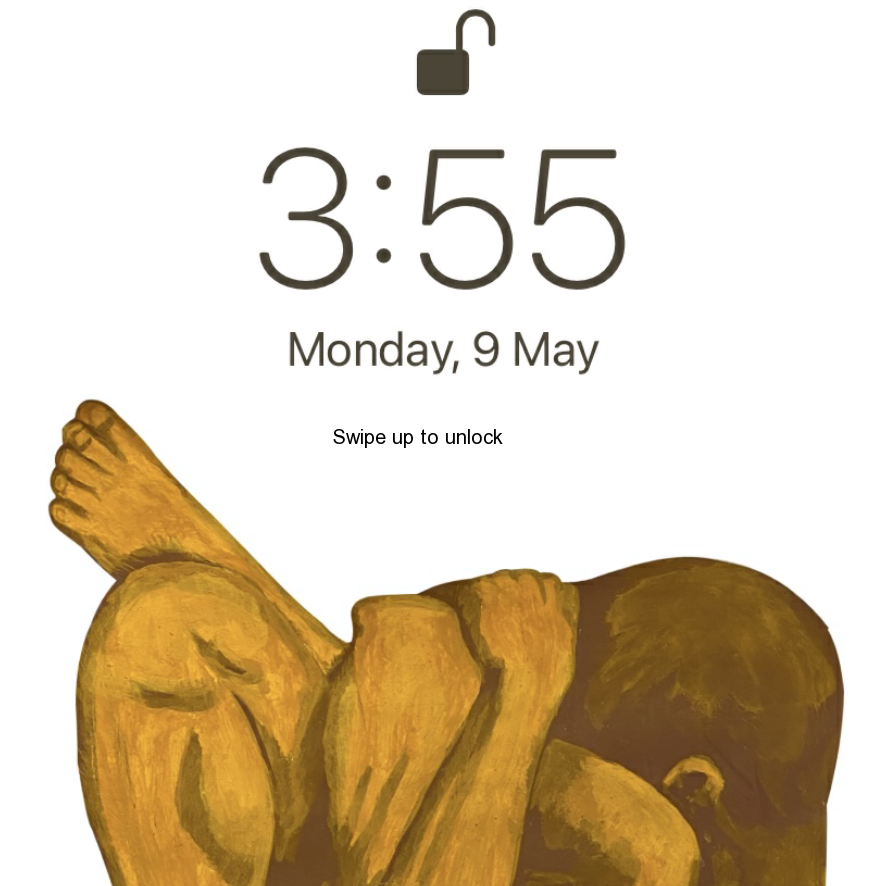
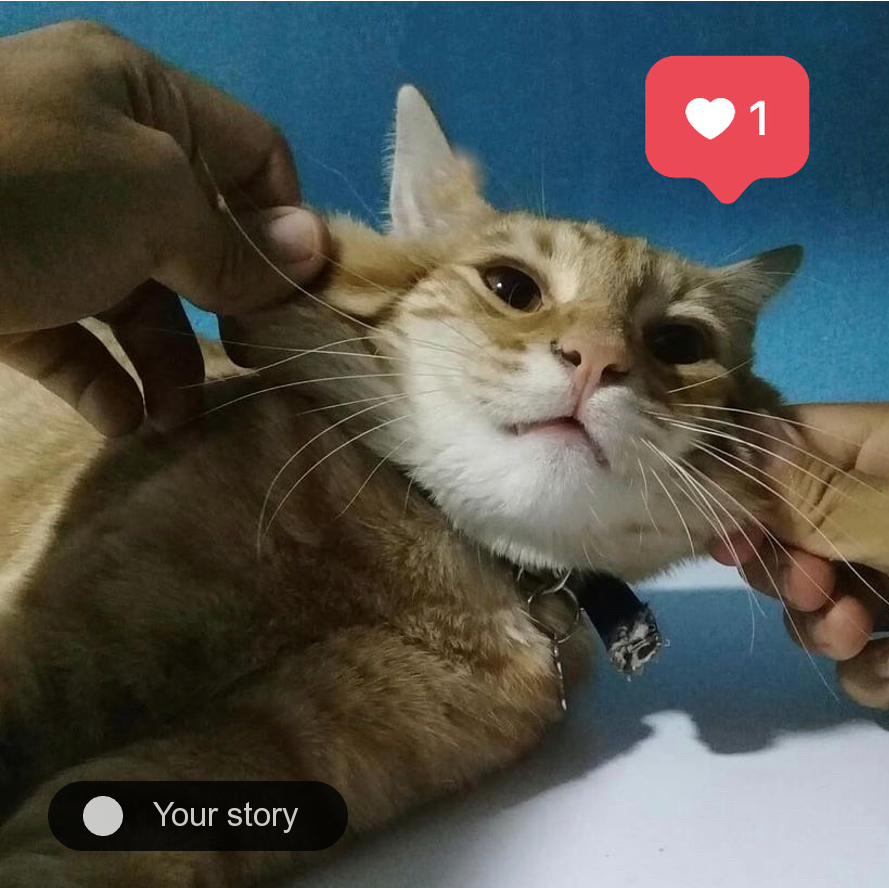
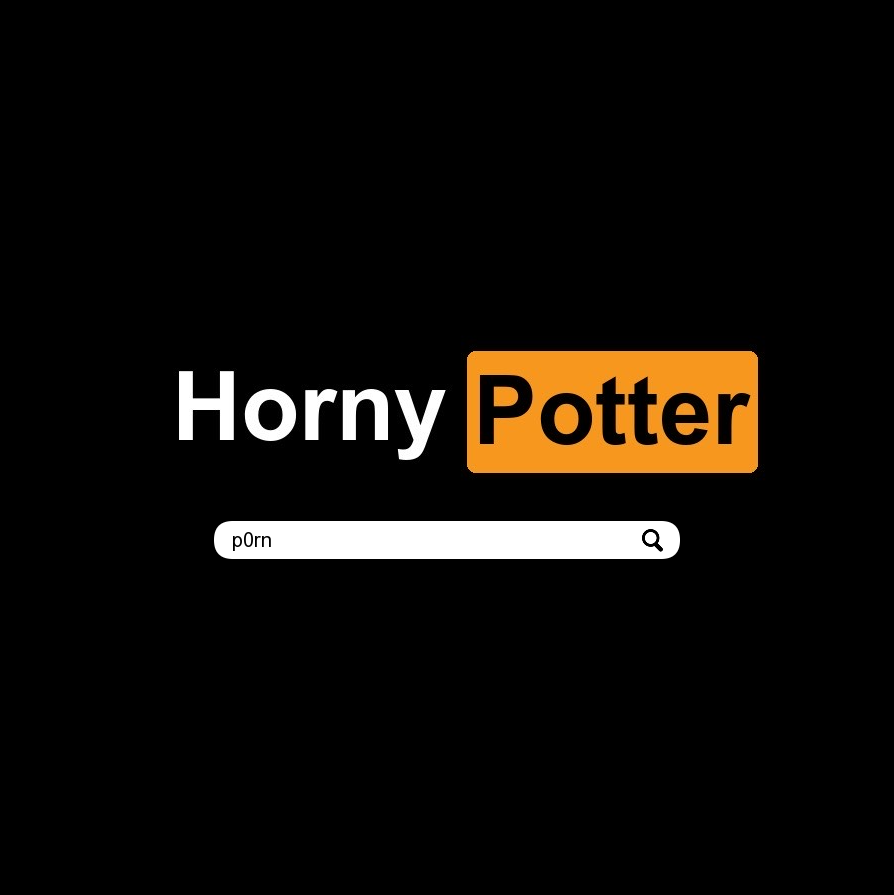
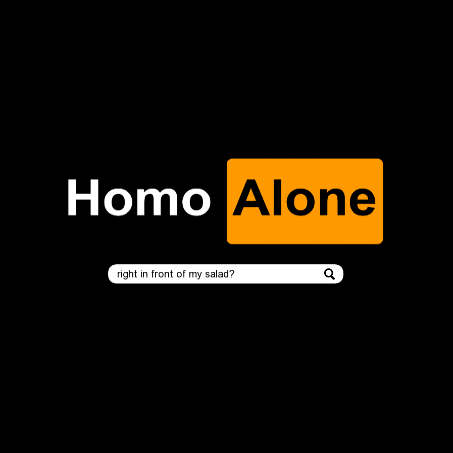

# iPhock 2 | May 9th, 2022

Created by Andres Ugartechea Palma (au2045) & Chi-Ting Tsai (ct2653)

_iPhock 2_ is an artwork developed on OpenFrameworks by Andres Ugartechea Palma and Chi-Ting Tsai. The purpose of this piece is to portray the process of sexual self-discovery in modern times through six short interactive scenes.

## Story and Concept|

The application is intended to bring to the surface of one's exploration of self, especially the discovery of sexuality as it is commonly tied with stigma and various forms of shame. Humans are sexual beings. There are certain aspects of sexuality that is present in the media that we are now enabled by the internet to access and explore by ourselves. It is natural for adolescents to become curious and inquire more. However, explicit dicussion of sex or anything related it is considered a tabboo, let alone the complication of homosexuality or anything non-heteronormative. We would like to highlight this necessity of open information and conversation about sex and its subjectivity, complexity, and importance to our identity. The app contains shapes and images that construct the interface of a daily electronic device such as a smartphone or a laptop, evoking a sense of relatability to the audience yet distancing them behind the screen throughout the narrative. 

The story of this project is not intended to be linear, but it concludes with the user getting phone called by their father. This is something that seeks to represent that even though sexual discovery is a normal and necessary process in adolescence, it’s a taboo topic that society doesn’t dare to talk about that easily.

### Scene 1 - Lock Screen 

·Description: The scene resembles a phone's lock screen. Time, background picture, and instruction are inculded. 
·Action: The user click and drag the cursor upward to change the scene. 
·Special functions/codes/logic included: _mouseDragged()_ function is used to move to the next scene.
·Shapes and colors: The aesthetics are meant to resemble an iPhone lockscreen, which alludes to the title of the piece.

 

### Scene 2 - Selfie Camera 

·Description: The scene constructs a front camera and a shuttle button, with a picture of a cat behind it.   
·Action: The user moves the cursor downwards (increases Y value) to decrease the opacity of the front camera, revealing the picture of the cat underneath. 
·Special functions/codes/logic included: Based on [Dan Buzzo's tutorial](https://www.youtube.com/watch?v=S0ZBDbNddm4), this interaction receives input from the camera to replace all the pixels for ASCII characters. The alpha value of this feature is linked to the mouseY position, so when the cursor reaches the button the effect becomes transparent. In the same way, the image of a cat is display and its alpha value is inversely proportional to the effect’s transparency. After clicking on the camera button, a new button appears to move to the next scene.
·Shapes and colors: The shapes and colors of this scene seek to imitate the aesthetics of Instagram filters and Intagram Stories.

  

### Scene 3 - Messages on Social Media

·Description: The scene micmics the chat function of social media, with rectangular text messages. 
·Action: The user moves the cursor across the screen (the Y axis) to rotate the rectangles to the pre-determined range. Once the color changes, click the mouse to reveal the message and move on to the next one.
·Special functions/codes/logic included: _ofRotate(X/Y/Z)_ is used with each rectangle drawn. Its rotation varies according to the mouseX or mouseY. The user can move one rectangle at a time to find the correct position that displays a message on the screen.
·Shapes and colors: The color palette is taken from the Messenger app and the shapes represent the message boxes.

  

### Scene 4 -  Pornography Website

·Description: The scene presents a website for pornography and a search through different genres of porn. Icons of sexual positions show up after respective search. 
·Action: The user presses the keys and enter the search. Mo matter what is inputted, a pre-set keyword is displayed. A series of pictures show up and the user presses enter to continue. 
·Special functions/codes/logic included: When a key is pressed, a counter increases and is used to slice a string. Each time a key is pressed, a new letter from the string appears. When the text from the string is completely displayed, the user can press _ENTER_ to move to the next part of the scene and watch a short animation.
·Shapes and colors: The scene imitates the aesthetics of a famous pornography website. The shapes seek to represent people having sex.

    

### Scene 5 - Spoken Diary 

·Description: The scene showcases a diary written in both Mandarin and Spanish by us slowly appearing and several polylines pulsing with the recording by us in the background. 
·Action: The user listens through the scene and presses enter to continue
·Special functions/codes/logic included: Based on [Lewis Lepton's tutorial]( https://www.youtube.com/watch?v=DfiIvAdrlRg&t=453s), this scene takes input from an audio and draws multiple curves that move according to the sound spectrum. The audio position is used as reference for the alpha values of the polylines and the image displayed. When the audio ends, the polylines fade away and the image appears.
·Shapes and colors: This scene imitates the style of the Notes app on the iPhone. The polylines symbole the process between thinking and writing down your thoughts.

   

### Scene 6 -  Music Streaming

·Description: The scene resembles a music streaming platform playing Lady Gaga's Born This Way and an rainbow-colored audio visualizer moving with the music. The music stops with the ringtone playing and a notification of incoming call from Dad. That's the end. 
·Action: The user presses space bar to play the music and enjoy the rest of the scene. 
·Special functions/codes/logic included: 	Based on [Dan Buzzo's tutorial]( https://www.youtube.com/watch?v=SSEnu6mp7y8), this part draws different rectangles forming a circle, changing the height according to the sound spectrum. Using the audio position, the music is stopped to display a phone call notification with a ringtone.
·Shapes and colors: The colors are meant to represent the rainbow flag to reinforce the lyrics of the song that talk about celebrating sexual diversity. This contrasts with the dark red of the phone call notification that interrupts the song and symbolizes the oppression of Queer people. The shapes imitate the aesthetics of a music player app.
	
  

[Performance video](https://www.youtube.com/watch?v=feK29NK3rF0)
