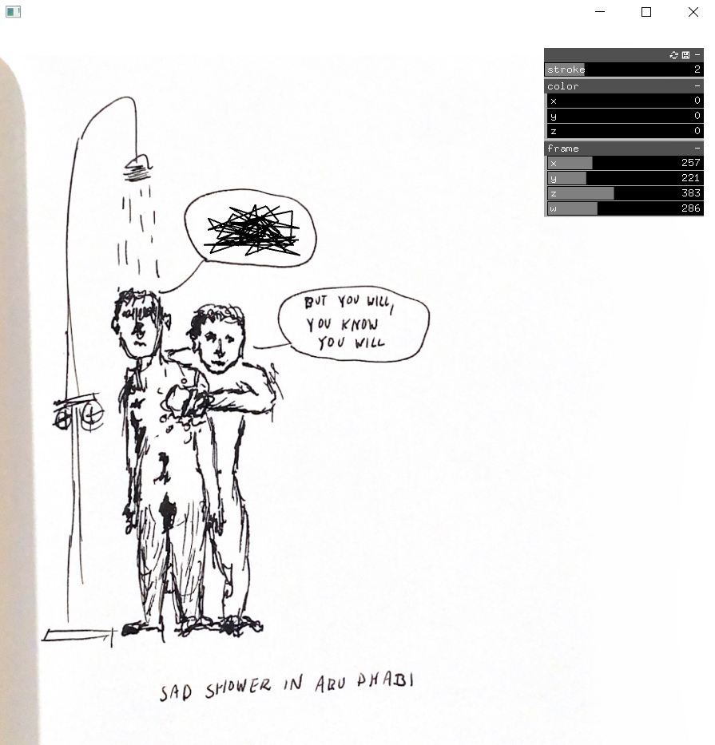
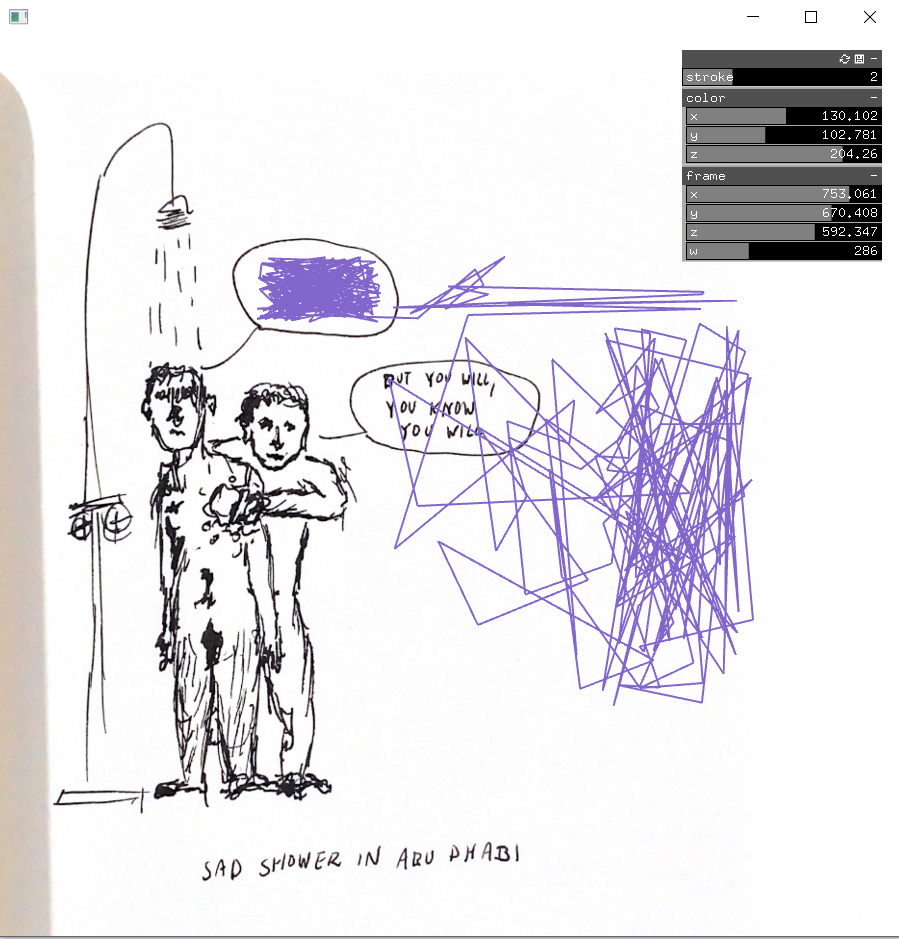
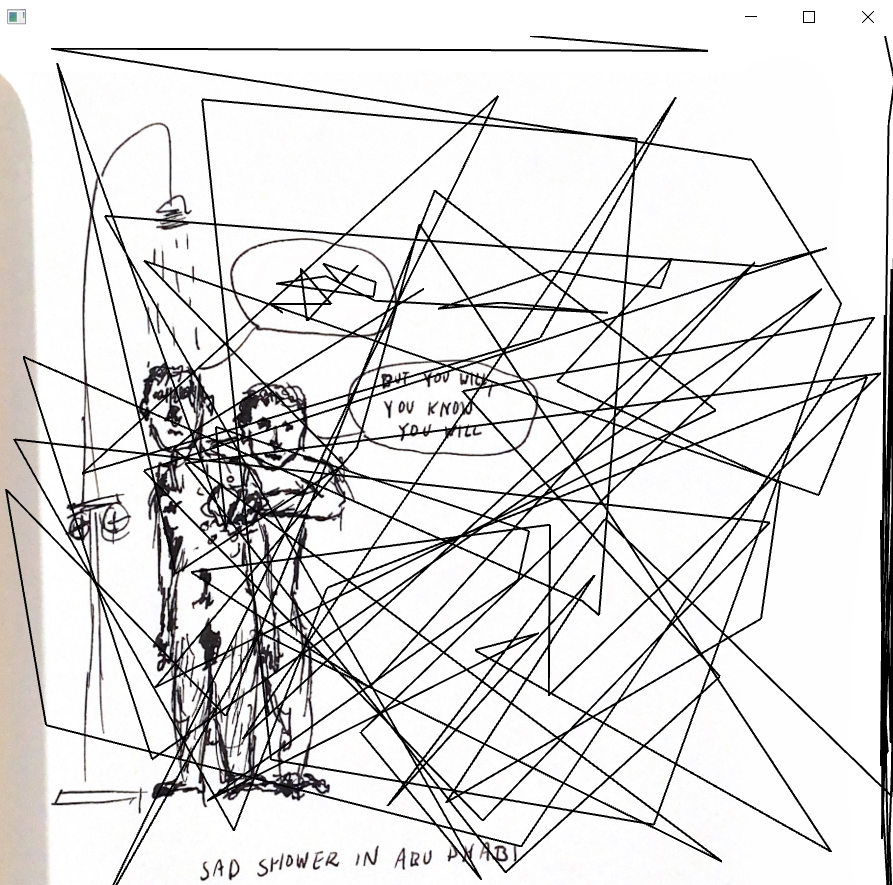

## Week 7 and 8:

### Class VII-VIII | March 28th: _"MAKE a Node-Express app that incorporates Socket.io. Try to incorporate the following: At least one ‘emit’ event on the server-side and one ‘emit’ event on the client-side The ability to open 2 browser tabs and share data in real-time between the two."_

 

In the exercises that we did in class, we learned how to make a [drawing app](https://github.com/MathuraMG/ConnectionsLabSpring22/tree/master/Week_8_Sockets) and a [simple chat room](https://github.com/MathuraMG/ConnectionsLabSpring22/tree/master/Week_9_Sockets). Both exercises helped me discover how to use [socket.io](https://socket.io/docs/v4/) to build my first connected application. My goal for this assignment was to combine both projects and create something where the user gives text input and draws on a P5.js canvas.

#### Wireframe and steps:

This idea started as a collage maker, where the user could insert the URL of an image and then this would appear on the canvas. Nonetheless, I couldn't figure out how to prevent the program from crashing before the user gives an input, since P5.js asks to preload the images in 'function setup()' before being able to display them. For this reason, my idea shifted to a "Graffiti Wall" with the same principles as the collage maker: the user is asked to insert a message and then they can place it wherever they want. Potentially, I will come back to this idea, because it'd fun to have a collective virtual collage maker.

 
