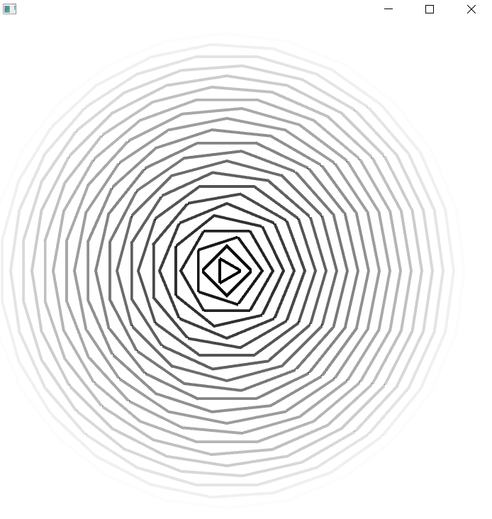
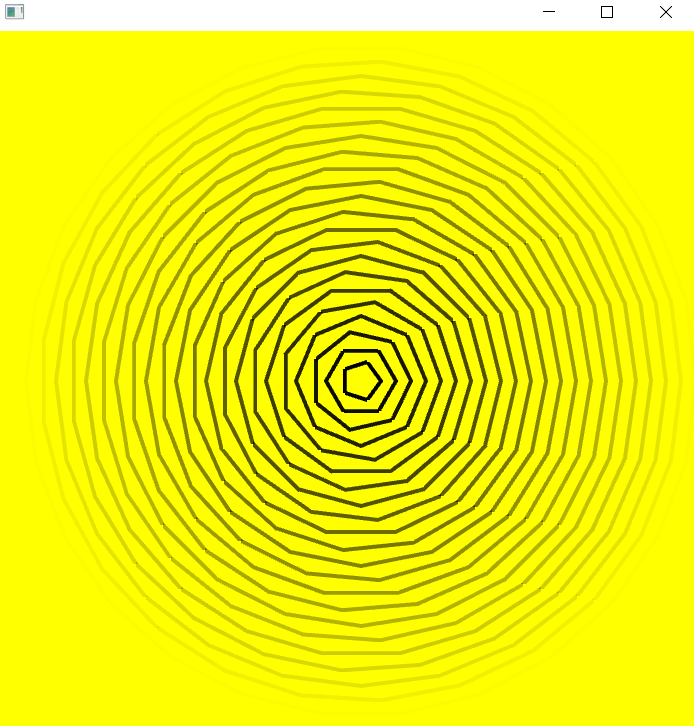

## Week 4:

### Sketch 2 - Animation | April 18th: _"Code an openFrameworks app (sketch) that makes a cyclical animation"_

  

The concept of this sketch is to code an offset path. This is something that I want to polish and elaborate on in my second assignment, trying to get a result similar to what Zach Lieberman shows in his video [_Poetic computation_](https://www.youtube.com/watch?v=bmztlO9_Wvo&t=82s).

In the same way, I aim with this sketch to experiment with different ways to change the behavior of an animation. The two methods that I implemented here are:
- The drawing changes based on the coordinates of an object: the central figure gets one extra side every time it collides with the left or right border.
- The drawing changes color after some time period: the background goes from white to yellow every 5 seconds twice and then stays white.

For the next steps, I want to keep working on testing the other methods to use time as a variable and using images or videos to draw the offset paths.
